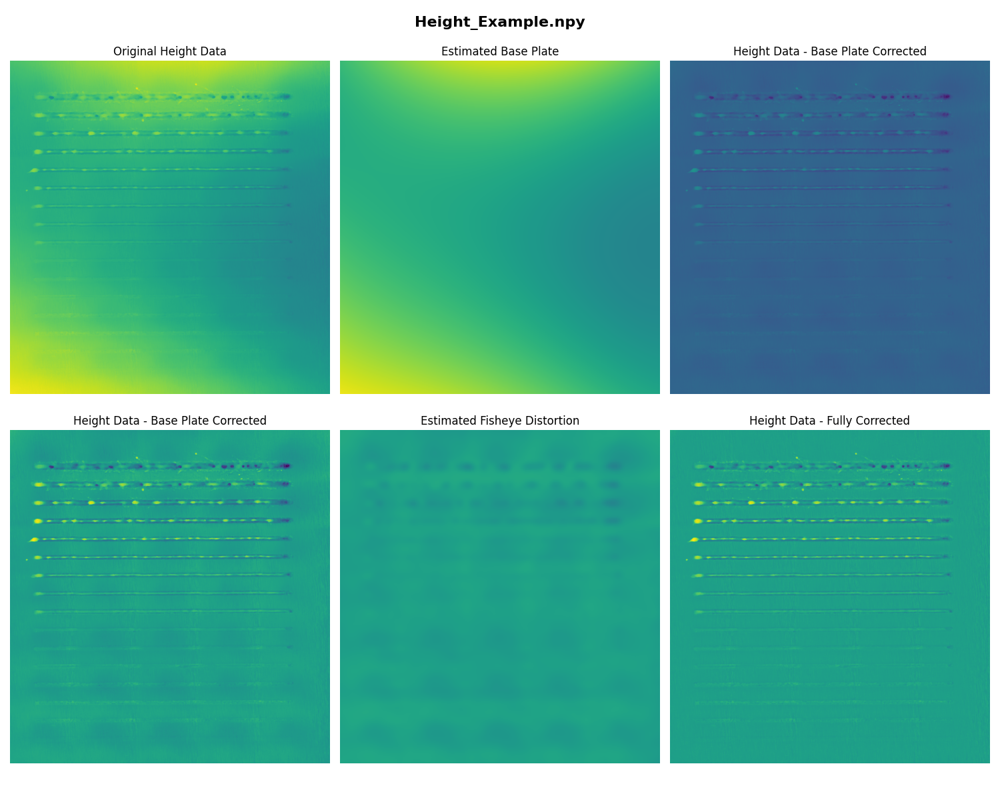

# Height Profile Flattening

## Introduction
The **Height Profile Flattening** process is designed to correct distortions in height maps obtained from profilometry data. The primary goal is to remove large-scale deviations, such as base plate curvature and fisheye distortion, while preserving important structural details. This method employs a combination of **downsampling, median filtering, polynomial fitting, and Gaussian smoothing** to achieve an accurate, flattened height profile.

---

## **Height Flattening Overview**

The following diagram provides an overview of the height flattening process:



---

## **Overview of the Flattening Process**

The height profile flattening consists of multiple stages:
1. **Preprocessing** – Load and filter the height map to remove extreme values.
2. **Base Plate Estimation** – Downsample, filter, and fit a polynomial surface to correct base curvature.
3. **Distortion Estimation** – Refine corrections using a secondary precise estimation method.
4. **Final Flattening** – Subtract distortions to obtain a corrected height profile.

This approach ensures high accuracy in measurements by removing artifacts while retaining critical surface details.

---

## **Step-by-Step Breakdown**

### **1. Preprocessing and Filtering**
Before estimating the base plate, extreme height values are filtered and missing data is extrapolated:

```python
def filter_and_extrapolate(height_map: np.ndarray, min_percentile: float, max_percentile: float) -> np.ndarray:
    min_value = np.percentile(height_map, min_percentile)
    max_value = np.percentile(height_map, max_percentile)
    mask = (height_map >= min_value) & (height_map <= max_value)
    filtered_map = np.where(mask, height_map, np.nan)
    nan_mask = np.isnan(filtered_map)
    dist_transform, indices = scipy.ndimage.distance_transform_edt(nan_mask, return_indices=True)
    filled_map = filtered_map.copy()
    filled_map[nan_mask] = filtered_map[tuple(indices[:, nan_mask])]
    return filled_map
```

This step removes outliers and ensures continuous data by filling missing regions with interpolated values.

---

### **2. Base Plate Estimation**
The base plate is estimated through a sequence of processing steps:

1. **Downsampling** – Reduces resolution to smooth out noise.
2. **Median Filtering** – Removes isolated artifacts while preserving edges.
3. **Polynomial Surface Fitting** – Models large-scale curvature.
4. **Gaussian Smoothing** – Refines the corrected surface before final adjustments.

```python
def estimate_base_plate(height_data, downsample_factor=10, filter_size=15, poly_degree=3, smooth_sigma=5):
    height_data = filter_and_extrapolate(height_data, 5, 95)
    height_small = downsample_image(height_data, downsample_factor)
    base_small = median_filter(height_small, size=filter_size)
    base_poly = fit_polynomial_surface(base_small, degree=poly_degree)
    base_large = upsample_image(base_poly, height_data.shape)
    base_smoothed = gaussian_filter(base_large, sigma=smooth_sigma)
    return base_smoothed
```

This process corrects for any curvature present in the height map.

---

### **3. Refining Distortion Estimation**
A second estimation process refines the corrections, especially for fisheye distortion.

```python
def estimate_base_plate_precise(height_data, downsample_factor=5, filter_size=5, smooth_sigma=2):
    height_data = filter_and_extrapolate(height_data, 5, 95)
    height_small = downsample_image(height_data, downsample_factor)
    base_small = median_filter(height_small, size=filter_size)
    x = np.linspace(0, base_small.shape[1] - 1, base_small.shape[1])
    y = np.linspace(0, base_small.shape[0] - 1, base_small.shape[0])
    xx, yy = np.meshgrid(x, y)
    base_poly = griddata((xx.ravel(), yy.ravel()), base_small.ravel(), (xx, yy), method='cubic')
    base_poly = gaussian_filter(base_poly, sigma=smooth_sigma)
    base_large = upsample_image(base_poly, height_data.shape)
    return base_large
```

This function provides an alternative, localized correction for distortions that may not be fully removed in the initial base plate estimation.

---

### **4. Final Flattening**
The corrected base plate and distortions are subtracted to obtain a flattened height profile:

```python
def flatten_heightmap(height_data, base_plate):
    return height_data - base_plate
```

After obtaining the base plate correction and distortion estimation, the final result is computed as:

```python
def flatten_height_profile(height_npy_filepath, plot_extractions=True):
    height_data = load_height_data(height_npy_filepath)
    base_plate = estimate_base_plate(height_data, downsample_factor=12, filter_size=15, poly_degree=4, smooth_sigma=5)
    height_corrected = flatten_heightmap(height_data, base_plate)
    distortion = estimate_base_plate_precise(height_corrected, downsample_factor=12, filter_size=8, smooth_sigma=3)
    final_height_profile = flatten_heightmap(height_corrected, distortion)
    if plot_extractions:
        plot_height_maps(height_data, base_plate, distortion, height_corrected, final_height_profile, title=os.path.basename(height_npy_filepath))
```

This function fully processes and corrects the height data, ensuring accuracy and consistency.

---

## **Conclusion**
This structured approach ensures that **height maps are accurately flattened**, removing curvature, noise, and distortions while preserving critical surface details. The combination of downsampling, median filtering, polynomial fitting, and Gaussian smoothing creates a robust pipeline for refining profilometry data.

