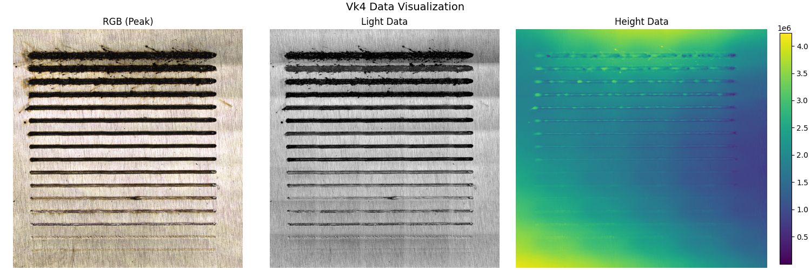

# Vk4 Extractor: Extracting RGB, Light, and Height Data from Vk4 Files

## Introduction
The **Vk4 Extractor** is a Python-based tool designed to extract and analyze data from **Keyence Vk4 profilometry files**. This tool enables users to retrieve three critical types of information:

- **RGB Image Data** – Captures color information from the scanned surface.
- **Light Intensity Data** – Represents grayscale light intensity at each pixel.
- **Height Map Data** – Provides 3D topographical details of the scanned surface.

This extraction process facilitates both **visual and structural analysis** of a sample.

---

## **Extraction Process Overview**
The Vk4 Extractor follows a structured pipeline to retrieve and visualize data efficiently. Below is a high-level representation of the workflow:



Each dataset (RGB, Light, and Height) is extracted in a sequential process by parsing the binary `.vk4` file structure.

---

## **Technical Details**

### **1. Extracting Data Offsets**
Vk4 files store datasets at fixed memory locations. The extractor first reads **offsets** to determine where each dataset is stored.

```python
import struct

def extract_offsets(f):
    f.seek(12)
    offsets = {
        'color_peak': struct.unpack('<I', f.read(4))[0],
        'color_light': struct.unpack('<I', f.read(4))[0],
        'light': struct.unpack('<I', f.read(4))[0]
    }
    f.seek(8, 1)
    offsets['height'] = struct.unpack('<I', f.read(4))[0]
    return offsets
```

This method ensures efficient retrieval of structured data.

---

### **2. Extracting RGB Image Data**
The RGB image represents **color peak intensity** per pixel.

#### **Process:**
- The **width** and **height** are read first.
- Each pixel consists of **three bytes (B, G, R)** to match the stored order.
- The extracted values are stored in a **NumPy array**.

```python
import numpy as np

def extract_rgb_data(f, offset):
    f.seek(offset)
    width = struct.unpack('<I', f.read(4))[0]
    height = struct.unpack('<I', f.read(4))[0]
    
    rgb_array = np.zeros((height, width, 3), dtype=np.uint8)
    for y in range(height):
        for x in range(width):
            b, g, r = f.read(1), f.read(1), f.read(1)
            rgb_array[y, x] = [r[0], g[0], b[0]]
    return rgb_array
```

#### **Output:**
A full **RGB image** where each pixel is represented as a tuple `(R, G, B)`.

---

### **3. Extracting Light Intensity Data**
This dataset represents **grayscale intensity**, indicating variations in surface illumination.

#### **Process:**
- Data is stored as **16-bit unsigned integers (`uint16`)**.
- Each pixel is extracted as a **2-byte chunk**.
- A **768-byte palette section** is skipped before reading actual values.

```python
def extract_light_data(f, offset):
    f.seek(offset)
    width = struct.unpack('<I', f.read(4))[0]
    height = struct.unpack('<I', f.read(4))[0]
    f.read(768)
    
    light_array = np.zeros((height, width), dtype=np.uint16)
    for y in range(height):
        for x in range(width):
            light_array[y, x] = struct.unpack('<H', f.read(2))[0]
    return light_array
```

#### **Output:**
A **grayscale light intensity image**, where brighter regions have higher intensity values.

---

### **4. Extracting Height Data (3D Surface Information)**
The **height map** provides **surface elevation measurements**.

#### **Process:**
- Data is stored as **32-bit unsigned integers (`uint32`)**.
- Each pixel requires **4 bytes**.
- A **768-byte palette section** is skipped before reading values.

```python
def extract_height_data(f, offset):
    f.seek(offset)
    width = struct.unpack('<I', f.read(4))[0]
    height = struct.unpack('<I', f.read(4))[0]
    f.read(768)
    
    height_array = np.zeros((height, width), dtype=np.uint32)
    for y in range(height):
        for x in range(width):
            height_array[y, x] = struct.unpack('<I', f.read(4))[0]
    return height_array
```

#### **Output:**
A **height map**, where each pixel represents the measured height at that location.

---

### **5. Visualizing Extracted Data**
The visualization function now includes a title derived from the filename:

```python
import matplotlib.pyplot as plt

def visualize_data(rgb_arr=None, light_arr=None, height_arr=None, title="Vk4 Data Visualization"):
    fig, axs = plt.subplots(1, 3, figsize=(15, 5), constrained_layout=True)
    fig.suptitle(title, fontsize=14)
    
    if rgb_arr is not None:
        axs[0].imshow(rgb_arr)
        axs[0].set_title("RGB (Peak)")
        axs[0].axis("off")
    
    if light_arr is not None:
        axs[1].imshow(light_arr, cmap='gray')
        axs[1].set_title("Light Data")
        axs[1].axis("off")
    
    if height_arr is not None:
        im = axs[2].imshow(height_arr, cmap='viridis')
        axs[2].set_title("Height Data")
        axs[2].axis("off")
        plt.colorbar(im, ax=axs[2], fraction=0.046, pad=0.04)
    
    plt.show()
```

### **6. Extracting and Visualizing Data**
The function now extracts and visualizes data with an optional title:

```python
def extract_vk4_data(vk4_filepath, extract_rgb=True, extract_light=True, extract_height=True, plot_extractions=True):
    if not vk4_filepath.endswith(".vk4"):
        raise ValueError("Invalid file format. Please provide a .vk4 file.")
    
    filename = os.path.basename(vk4_filepath)
    
    with open(vk4_filepath, 'rb') as f:
        offsets = extract_offsets(f)
        rgb_arr = extract_rgb_data(f, offsets['color_peak']) if extract_rgb else None
        light_arr = extract_light_data(f, offsets['light']) if extract_light else None
        height_arr = extract_height_data(f, offsets['height']) if extract_height else None
    
    if plot_extractions:
        visualize_data(rgb_arr, light_arr, height_arr, title=filename)
    
    return rgb_arr, light_arr, height_arr
```
