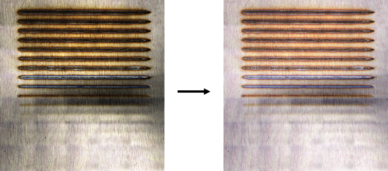
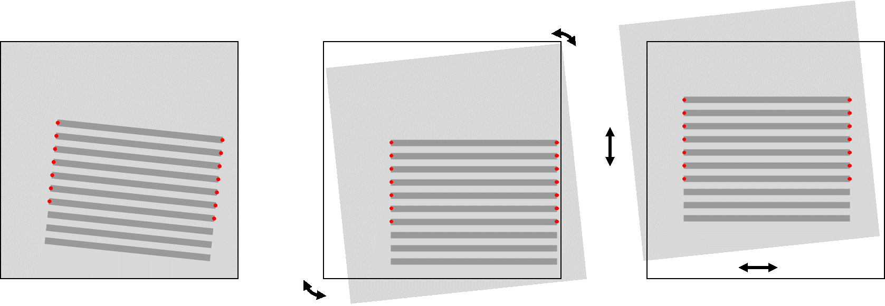
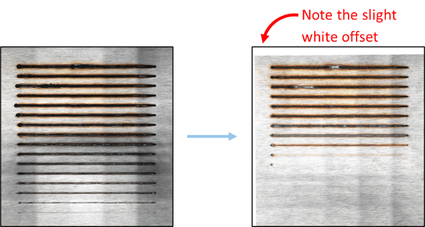
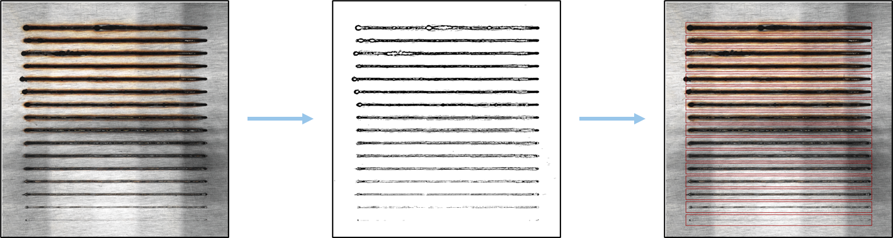

# **Weld Alignment**

## **Introduction**
The **Weld Alignment Process** standardized the positioning of weld images,
ensuring consistent analysis. This standardization allowed for individual RGB weld images as
well as height profiles to be extracted for analysis. Since a jig was not used to ensure welds were positioned
in the same exact position between samples, it was necessary to preprocess the imagery and align every weld. This
process involves **image preprocessing, alignment, and weld location extraction**.

---

## **Image Preprocessing and Cleaning**
One challenge during imaging was that **the thin metal sheets deformed slightly**, causing **uneven light reflection**. To mitigate this, **image preprocessing** was performed using **contrast enhancement and binarization**.

### **Processing Steps:**
1. Convert the image to **grayscale**.
2. Apply **contrast adjustments** to enhance visibility.
3. Use **adaptive thresholding** for binarization.

#### **Code Snippet: Image Preprocessing**
```python
def preprocess_image(img, contrast=2.0, brightness=10):
    """Enhances contrast and binarizes the weld image."""
    grayscaled_img = cv2.cvtColor(img, cv2.COLOR_BGR2GRAY)
    enhanced_img = cv2.convertScaleAbs(grayscaled_img, alpha=contrast, beta=brightness)
    binary_img = cv2.adaptiveThreshold(enhanced_img, 255, cv2.ADAPTIVE_THRESH_GAUSSIAN_C, cv2.THRESH_BINARY, 155, 20)
    return binary_img
```

**Below is an example of an RGB weld image before and after brightness and contrast adjustments.**



---

## **Aligning Weld Images**
Before extracting weld features, image alignment was performed to ensure consistent positioning.

### **Alignment Approach:**
- Since every test consisted of 16 welds with similar spacing, a template was made to ensure every image would be
aligned in the same manner.
- **Key points** were marked using histogram data and then latter manually inspected and adjusted if necessary. The key points were used to mark
marked the start and end of each reasonably visible weld in the image.
- **OpenCV’s homography transformation** was used to align all images based on the keypoints and extrapolating where the rest of the 16 welds should be if not all welds were identified.

#### **Code Snippet: Image Alignment**
```python
def align_images(reference_image, target_image, keypoints_ref, keypoints_target):
    """Aligns target_image to reference_image using keypoint matches."""
    transformation_matrix, _ = cv2.findHomography(keypoints_target, keypoints_ref, cv2.RANSAC)
    aligned = cv2.warpPerspective(target_image, transformation_matrix, (reference_image.shape[1], reference_image.shape[0]))
    return aligned
```

**A visual guide below illustrates how the alignment process ensures that all weld images are standardized.**



Below is an example of an actual aligned weld image after applying the transformation matrices.



---

## **Determining Weld Locations**
Once the images were preprocessed and aligned, the weld locations were extracted.

### **Detection Methodology**
1. **Binarization** was applied to highlight welds.
2. **Blob detection** was used to locate weld regions.
3. **Contours** were extracted and grouped.

#### **Code Snippet: Weld Detection**
```python
def detect_welds(image, threshold=100):
    """Detects weld locations using adaptive thresholding and contour detection."""
    gray = cv2.cvtColor(image, cv2.COLOR_BGR2GRAY)
    _, binary = cv2.threshold(gray, threshold, 255, cv2.THRESH_BINARY_INV)

    contours, _ = cv2.findContours(binary, cv2.RETR_EXTERNAL, cv2.CHAIN_APPROX_SIMPLE)
    welds = [cv2.boundingRect(cnt) for cnt in contours]  # Get bounding boxes
    return welds
```

**The image below shows an example of weld detection after binarization and blob detection.**



Sometimes, due to contrast issues, some welds were not fully detected. To handle these cases, known weld spacing constraints were used to extrapolate missing welds.

#### **Code Snippet: Missing Weld Estimation**
```python
def extrapolate_missing_welds(detected_welds, expected_spacing):
    """Estimates missing weld locations based on expected spacing constraints."""
    detected_welds = sorted(detected_welds, key=lambda x: x[1])  # Sort by Y position
    for i in range(len(detected_welds) - 1):
        if detected_welds[i + 1][1] - detected_welds[i][1] > expected_spacing:
            estimated_y = detected_welds[i][1] + expected_spacing
            detected_welds.append((detected_welds[i][0], estimated_y, detected_welds[i][2], detected_welds[i][3]))
    return sorted(detected_welds, key=lambda x: x[1])
```

---

## **Conclusion**
The **Weld Alignment Process** ensures all images are standardized for analysis. By leveraging:

- **Image Preprocessing**
- **Alignment with OpenCV**
- **Blob Detection for Weld Extraction**
- **Extrapolation for Missing Data**

This approach created a robust, reproducable workflow for weld analysis. Importantly, the same affline adjustments could be made to the height data.
Therefore, by aligned every RGB image, we could also similarly align the height data which allows us to also consistently reproduce the heightmap to classify the surface roughness.
---

## References
- [OpenCV Documentation](https://docs.opencv.org/)
- [Image Processing Techniques for Weld Analysis]

